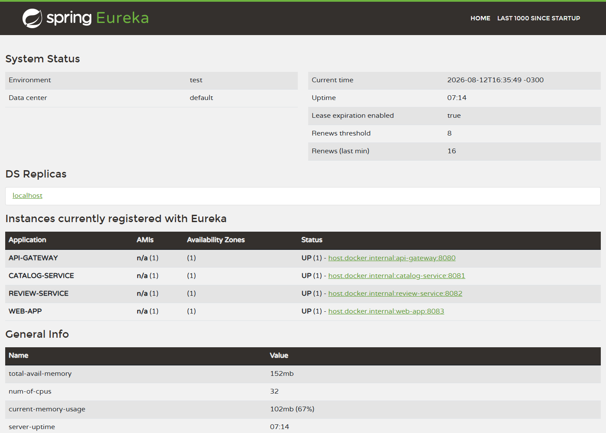
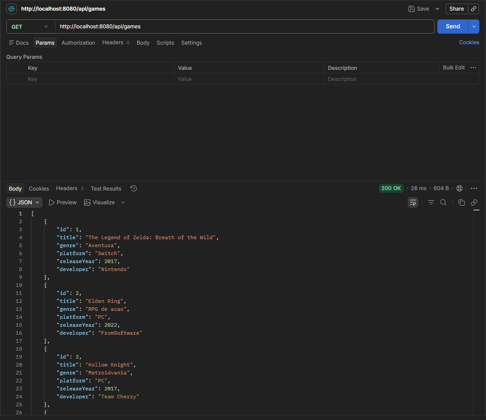
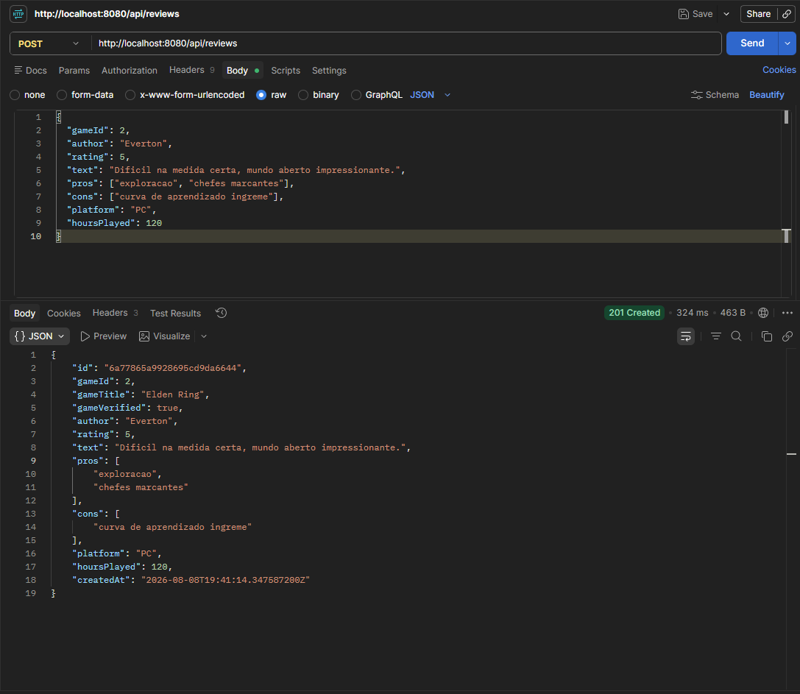
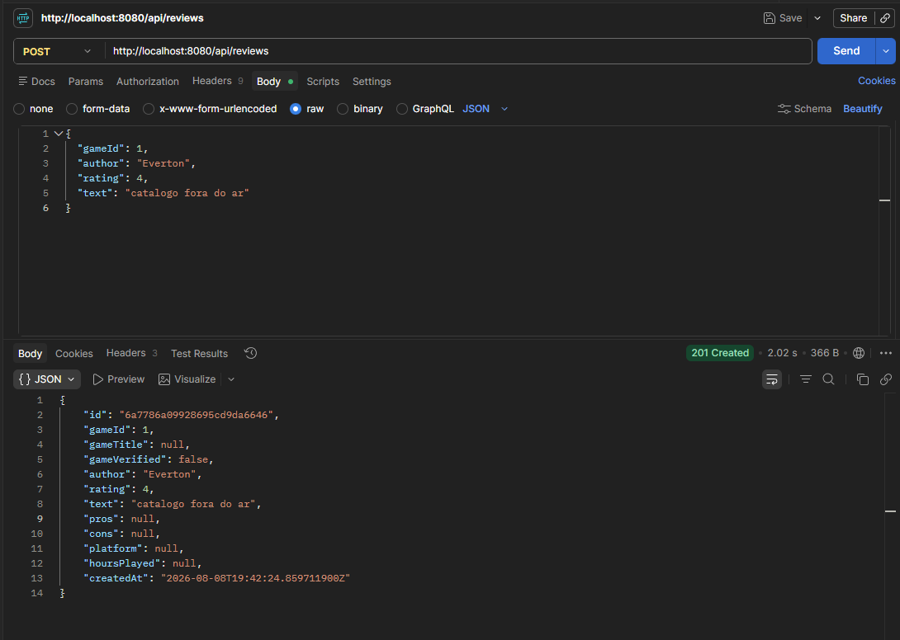

# GameLog - Proposta e Arquitetura Inicial de Microservices

**Disciplina:** Microsserviços e DevOps com Spring Boot e Spring Cloud - Entrega 1 (TP1)

## 1. Identificação

| Item | Valor |
|---|---|
| Integrante | Everton Rocha |
| Turma | GRLENGR2C2-N2-L1 |
| Modalidade | Individual |
| Responsável pela organização da entrega | Everton Rocha |
| Repositório | https://github.com/evertonrocha2/gamelog-microservices |

Por ser um trabalho individual, todos os papéis ficam comigo: Discovery Server, API Gateway, os dois microservices de domínio, os bancos de dados, a documentação e os testes de execução.

| Integrante | Microservices sob responsabilidade | Banco |
|---|---|---|
| Everton Rocha | catalog-service | PostgreSQL |
| Everton Rocha | review-service | MongoDB |
| Everton Rocha | discovery-server, api-gateway | - |

## 2. Tema e problema

**GameLog** é uma plataforma de catálogo e resenhas de jogos.

**Problema que resolve:** quem joga não tem um lugar único pra registrar o que jogou e o que achou. Sites de review misturam nota de crítica com nota de usuário, e nenhum deixa o jogador manter um histórico próprio estruturado (nota, texto, prós, contras, horas jogadas, plataforma em que jogou).

**Usuários principais:**

- Jogadores, que escrevem resenhas e mantêm seu histórico;
- Visitantes, que consultam o catálogo e a nota média de cada jogo.

**Funcionalidades previstas nesta entrega:**

- CRUD do catálogo de jogos;
- Criação e consulta de resenhas, com validação do jogo no catálogo;
- Nota média e total de resenhas por jogo;
- Acesso único via API Gateway.

**Por que o tema combina com microservices:** o domínio tem duas cargas de trabalho muito diferentes. O catálogo é pequeno, estável e estruturado. As resenhas são conteúdo gerado por usuário: crescem rápido, têm estrutura flexível e concentram quase toda a escrita do sistema. São ciclos de vida, volumes e modelos de dados distintos, o que justifica serviços (e bancos) separados, cada um podendo escalar e evoluir sozinho. A divisão parou por aí de propósito: não criei serviço de usuário, notificação etc. nesta entrega porque ainda não há necessidade real, e fragmentar sem necessidade só adicionaria custo operacional (essa granularidade pode evoluir nas próximas entregas).

## 3. Arquitetura

```
                         ┌─────────────────────┐
        cliente ────────►│     api-gateway     │
                         │       :8080         │
                         └─────┬──────────┬────┘
                               │          │
              /api/games/**    │          │   /api/reviews/**
                               ▼          ▼
                    ┌────────────────┐  ┌────────────────┐
                    │ catalog-service│◄─┤ review-service │
                    │     :8081      │  │     :8082      │
                    └───────┬────────┘  └───────┬────────┘
                            │        Feign +    │
                            │        Resilience4j
                            ▼                   ▼
                     ┌────────────┐      ┌────────────┐
                     │ PostgreSQL │      │  MongoDB   │
                     │ catalogdb  │      │ reviewsdb  │
                     └────────────┘      └────────────┘

                    ┌─────────────────────────────────┐
                    │   discovery-server (Eureka)     │
                    │            :8761                │
                    └─────────────────────────────────┘
```

Fluxo de uma requisição: o cliente chama o gateway (8080), o gateway consulta o Eureka pra achar a instância do serviço de destino e repassa a chamada. Quando o review-service precisa validar um jogo, ele chama o catalog-service pelo nome lógico (`catalog-service`), também resolvido pelo Eureka, com circuit breaker e fallback no caminho.

**Como isso suporta escalabilidade:** nenhum componente referencia host/porta fixos de outro. Se eu subir três instâncias do review-service (em qualquer porta, `SERVER_PORT` é externalizado), todas se registram no Eureka e o gateway passa a balancear entre elas (`lb://review-service`) sem mudar uma linha de configuração. É o modelo de nuvem: instâncias vêm e vão, e a descoberta dinâmica + roteamento centralizado absorvem isso. Toda configuração sensível a ambiente (portas, URLs de banco, endereço do Eureka) sai por variável de ambiente, então o mesmo artefato roda local ou em nuvem.

## 4. Microservices

| Microservice | Responsabilidade | Porta | Banco | Por que existe separado |
|---|---|---|---|---|
| discovery-server | Registro e descoberta de serviços (Eureka) | 8761 | - | Infraestrutura: elimina acoplamento a host/porta |
| api-gateway | Ponto único de entrada, roteamento | 8080 | - | Cliente não conhece a topologia interna |
| catalog-service | Cadastro e consulta do catálogo de jogos | 8081 | PostgreSQL (`catalogdb`) | Fonte da verdade dos jogos; dados estruturados e estáveis |
| review-service | Resenhas, notas e resumo por jogo | 8082 | MongoDB (`reviewsdb`) | Conteúdo de usuário, flexível e de alto volume de escrita |

### catalog-service

- **Entidade principal:** `Game` (id, title, genre, platform, releaseYear, developer)
- **Endpoints:** `GET/POST /api/games`, `GET/PUT/DELETE /api/games/{id}`
- Sobe com carga inicial de 4 jogos pra facilitar os testes.

### review-service

- **Documento principal:** `Review` (id, gameId, gameTitle, gameVerified, author, rating 1 a 5, text, pros[], cons[], platform, hoursPlayed, createdAt)
- **Endpoints:** `GET/POST /api/reviews`, `GET/DELETE /api/reviews/{id}`, `GET /api/reviews/game/{gameId}`, `GET /api/reviews/game/{gameId}/summary`
- Ao criar uma resenha, valida o jogo no catalog-service e copia o título (com resiliência, seção 8).

## 5. Bancos de dados e separação

Cada serviço é dono dos seus dados, com database próprio:

| Serviço | Banco | Database | Acesso |
|---|---|---|---|
| catalog-service | PostgreSQL 16 | `catalogdb` | Só o catalog-service |
| review-service | MongoDB 7 | `reviewsdb` | Só o review-service |

Não existe base compartilhada. Quando o review-service precisa de dado do catálogo, ele pergunta pela API (nunca lê `catalogdb` direto). O `docker-compose.yml` declara os dois bancos como backing services, e as conexões são externalizadas (`DB_URL`, `MONGO_URI`), então trocar a instância local por uma gerenciada em nuvem não exige rebuild. Em uma etapa futura, a evolução natural é cada banco virar uma instância isolada por serviço.

## 6. Justificativa do banco não relacional

**Qual serviço:** review-service. **Qual banco:** MongoDB (como banco principal de persistência, não cache).

**Por que faz sentido:**

1. **Estrutura flexível.** Resenha é um documento semiestruturado: prós e contras são listas de tamanho livre, e campos como horas jogadas e plataforma são opcionais. No relacional isso viraria tabelas auxiliares (review_pros, review_cons) ou colunas quase sempre nulas. No Mongo, cada resenha é um documento único, e adicionar um campo novo (por exemplo, "rejogaria?") não exige migração de schema.

2. **Padrão de consulta.** A leitura dominante é "todas as resenhas do jogo X", que vira uma busca por índice em `gameId` devolvendo documentos completos, sem nenhum join. A resenha já carrega tudo que a tela precisa (inclusive o `gameTitle`, desnormalizado de propósito na criação).

3. **Comportamento do serviço.** Resenhas concentram a escrita do sistema e crescem sem limite, enquanto o catálogo fica pequeno. Um modelo de documentos escala horizontalmente bem pra esse perfil append-heavy.

4. **Agregações.** O resumo por jogo (nota média, contagem) mapeia direto pro aggregation framework do Mongo quando o volume crescer.

Já o **catalog-service ficou no PostgreSQL** porque jogo é dado tabular clássico: campos fixos, integridade forte, atualizações pontuais. É o caso em que o relacional é a escolha certa. No fim, o projeto acaba usando persistência poliglota: cada serviço com o banco que combina com a carga dele.

(Redis como cache ficou fora desta entrega de propósito; a análise de banco não relacional acima é sobre persistência principal, como o enunciado pede.)

## 7. Discovery Server e API Gateway

**Discovery Server (Eureka, porta 8761):** todos os serviços se registram na subida e se descobrem pelo nome lógico. O dashboard em http://localhost:8761 mostra as instâncias registradas. O review-service chama o catálogo por `catalog-service` (via OpenFeign) e o gateway roteia por `lb://catalog-service` e `lb://review-service`, ou seja, ninguém referencia porta de ninguém.

**API Gateway (Spring Cloud Gateway, porta 8080):** ponto único de entrada. Rotas configuradas:

| Rota externa | Destino |
|---|---|
| `/api/games/**` | `lb://catalog-service` |
| `/api/reviews/**` | `lb://review-service` |

O `lb://` integra o gateway ao Eureka com balanceamento de carga. O cliente só conhece a porta 8080.

## 8. Resiliência entre microservices

**Comunicação protegida:** `review-service` → `catalog-service` (validação do jogo ao criar resenha).

**Risco:** o catálogo pode estar fora do ar ou lento. Sem proteção, toda criação de resenha falharia junto (falha em cascata) ou seguraria a requisição do usuário.

**Mecanismos aplicados (Resilience4j + OpenFeign):**

| Mecanismo | Configuração | Efeito |
|---|---|---|
| Timeout | connect/read 2s no Feign, TimeLimiter 3s | Falha rápida em vez de segurar o usuário |
| Circuit Breaker | janela de 10 chamadas, abre com 50% de falha, 10s em estado aberto | Para de insistir em um serviço doente |
| Fallback | `CatalogClientFallback` devolve marcador "indisponível" | Degradação controlada em vez de erro |

**Comportamento com o catálogo fora do ar:** a resenha é aceita mesmo assim (201), gravada com `gameVerified: false` e sem título. A regra de negócio escolhida foi degradar em vez de rejeitar: perder a resenha do usuário por causa de uma falha interna seria pior. O campo `gameVerified` deixa registrado o que ainda precisa de verificação (uma rotina de reconciliação é evolução natural nas próximas entregas).

Detalhe de implementação: o Feign usa `dismiss404`, então "jogo não existe" (404 do catálogo, resposta válida) é tratado como erro de negócio (422) e não abre o circuito. O circuit breaker fica reservado pra falha de infraestrutura de verdade.

**Como simular:** derrubar o processo do catalog-service, criar resenhas via gateway (elas entram com `gameVerified: false`), consultar `http://localhost:8082/actuator/circuitbreakers` e ver o estado `OPEN`. Subindo o catálogo de novo, o circuito passa por `HALF_OPEN` e fecha, e as resenhas voltam a sair verificadas.

## 9. Evidências de execução

### Prints

As capturas de tela estão na pasta [print-evidencias](print-evidencias/):

**1. Discovery Server com os três serviços registrados** (dashboard do Eureka em http://localhost:8761, todos UP com suas portas):



**2. Rota pelo API Gateway** (GET /api/games na porta 8080 respondendo 200 com o catálogo):



**3. Comunicação entre microservices** (POST /api/reviews via gateway: o review-service consultou o catalog-service, validou o jogo e copiou o título, `gameVerified: true`):



**4. Resiliência em ação** (mesma chamada com o catalog-service derrubado: a resenha é aceita com `gameVerified: false`. Repare no tempo de resposta de 2.02s, que é o timeout de 2s do Feign esgotando antes do fallback assumir, contra 324ms da chamada anterior):



### Saídas de terminal

Saídas reais capturadas durante a execução local (as chamadas de API passam todas pelo gateway, porta 8080).

**Serviços registrados no Eureka** (`GET http://localhost:8761/eureka/apps`):

```
REVIEW-SERVICE  -> :8082 [UP]
API-GATEWAY     -> :8080 [UP]
CATALOG-SERVICE -> :8081 [UP]
```

**Catálogo via gateway** (`GET http://localhost:8080/api/games`):

```json
[{"id":1,"title":"The Legend of Zelda: Breath of the Wild","genre":"Aventura","platform":"Switch","releaseYear":2017,"developer":"Nintendo"},
 {"id":2,"title":"Elden Ring","genre":"RPG de acao","platform":"PC","releaseYear":2022,"developer":"FromSoftware"},
 {"id":3,"title":"Hollow Knight","genre":"Metroidvania","platform":"PC","releaseYear":2017,"developer":"Team Cherry"},
 {"id":4,"title":"Stardew Valley","genre":"Simulacao","platform":"PC","releaseYear":2016,"developer":"ConcernedApe"}]
```

**Criação de resenha com o catálogo no ar** (`POST /api/reviews`, jogo validado e título copiado):

```json
{"id":"6a73e827db8b9d2a5c9feea7","gameId":2,"gameTitle":"Elden Ring","gameVerified":true,
 "author":"Everton","rating":5,"text":"Dificil na medida certa, mundo aberto impressionante.",
 "pros":["exploracao","chefes marcantes"],"cons":["curva de aprendizado ingreme"],
 "platform":"PC","hoursPlayed":120,"createdAt":"2026-08-06T01:49:27.626Z"}
```

**Resenha de jogo inexistente** (gameId 999) é rejeitada com **HTTP 422**.

**Resumo por jogo** (`GET /api/reviews/game/2/summary`):

```json
{"gameId":2,"totalReviews":1,"averageRating":5.0}
```

**Resiliência: catálogo derrubado e resenha criada mesmo assim** (fallback):

```json
{"id":"6a73e9089c1ca4209e78274f","gameId":1,"gameTitle":null,"gameVerified":false,
 "author":"Maria","rating":4,"text":"Zelda continua atemporal, mapa gigante.", ...}
```

**Circuit breaker aberto após as falhas** (`GET :8082/actuator/circuitbreakers`):

```json
{"circuitBreakers":{"CatalogClientgetGameLong":{"failureRate":"100.0%","bufferedCalls":5,
 "failedCalls":5,"notPermittedCalls":1,"state":"OPEN"}}}
```

**Recuperação: catálogo religado, resenha volta a sair verificada e o circuito fecha:**

```json
{"id":"6a73e9659c1ca4209e782755","gameId":3,"gameTitle":"Hollow Knight","gameVerified":true, ...}

{"circuitBreakers":{"CatalogClientgetGameLong":{"failureRate":"-1.0%","failedCalls":0,"state":"HALF_OPEN"}}}
```

## 10. Como executar

Instruções completas no [README.md](../README.md). Resumo: `docker compose up -d` (bancos), `mvn clean package -DskipTests`, depois subir os 4 jars na ordem discovery → catalog → review → gateway. Exemplos de requisição prontos em `requests.http`.
